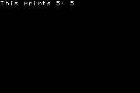

% GBA printf

It takes up one scrolling background, some background memory space, and a tiny amount of background palette space. If you're mindful of its small memory footprint and background requirements it should be compatible with just about any project, especially during development phases.

It may be useful to know that I use devKitArm and its arm-eabi-gcc. I could not get consistent or appropriate behavior from the `varargs()` macros, so I relied on the consistent size size of the call stack to pull out the variable-length argument list. Other compilers may break that code. However that hack is clearly labeled in the source code so you can tweak it to accommodate for any differences in the stack layout.

To use it, you call an initialization function, then you can print formatted strings just like with printf. It can print all standard (not extended) ASCII characters. It can format numbers in octal, decimal, and hexadecimal. The screen automatically scrolls down. There is no scrolling up.

```c
#include 'gba.h'
#include 'printf.h'

int main(){
   initTextBG(8,0,0);
   print_f('This prints 5: %d',5);
}
```


