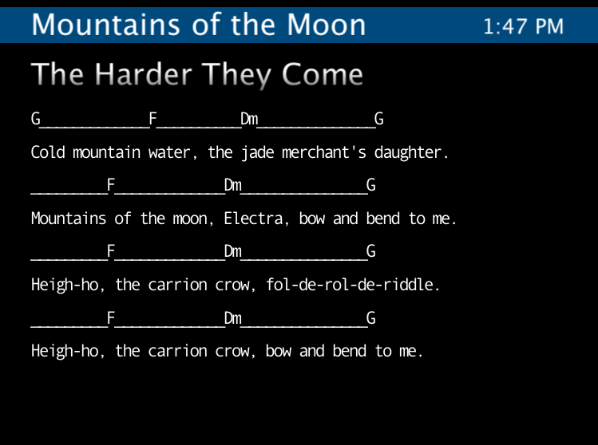

% Music Stand



* <a href="https://github.com/fcanas/MusicStand/releases/download/v1.0/MusicStand.zip">Download 3:4 Aspect Ratio</a>
* <a href="https://github.com/fcanas/MusicStand/releases/download/v1.0/MusicStand_wide_screen.zip">Download Widescreen</a>

A digital music stand. The idea is to have my computer onstage with a screen mounted up about where a music stand should be. I can select songs and page through them with a foot controller or keyboard. It also has a built-in clock, useful for making sure your set runs on schedule.

## Getting Songs In

XML. In the same directory as the OnStageReader file, you should put a file called songs.xml structured as follows:

```xml
&lt;data&gt;
   &lt;entry&gt;
      &lt;title&gt;Song Title Goes Here&lt;/title&gt;
      &lt;page&gt;
         &lt;line&gt;C#m_____________E&lt;/line&gt;
         &lt;line&gt;Some lyrics and chords like so.&lt;/line&gt;
      &lt;/page&gt;
   &lt;/entry&gt;
   &lt;entry&gt;
      &lt;title&gt;Another song&lt;/title&gt;
      &lt;page&gt;
         &lt;line&gt;Whatever you want.&lt;/line&gt;
      &lt;/page&gt;
      &lt;page&gt;
         &lt;line&gt;Whatever else.&lt;/line&gt;
      &lt;/page&gt;
   &lt;/entry&gt;
&lt;/data&gt;
```

The music stand program parses the XML file and everything just works. Currently multiple tabs and spaces are reduced to a single space, so I use underscores to appropriately space out chords. You are responsible for making sure lines don’t run off the screen, both off the side and off the bottom. In the future, I may implement auto line wrapping, but I prefer manual page generation. The whole point is that you get the information you need on stage, whether chords, notes or lyrics. To do that right, you ought to have complete control over formatting.

## State of the Project

Right now, I have a fully functional prototype. My biggest reservation in calling it done is that it runs hosted inside two other applications: Quartz Composer (which comes with Apple’s Developer Tools), and Pd (Miller Puckette’s PureData), both of which are free. With some work I can actually get this up and running as its own program and robustly accepting different types of control input. Only then will it be v1.0.

Next on the list of features is proper song management system. I want to be able to make a song library, and then make set lists like making a playlist in iTunes. This is definitely getting thrown into the mix when I make the program stand-alone.

Also, there is no reason why I couldn’t have this program display a real music staff, not just chords or tabs. These would be saved as vector graphics and either included straight in the xml or referenced from it. This feature will likely come much later as I only usually need lyrics and chords as a reminder of what notes to play.

## Running the Program

It works on Macs running OS 10.5. Quartz Composer has come with the Apple Developer Tools since OS 10.4, but this particular patch uses some new features in QC version 3.0. Pd is not necessary to get the patch working, but is necessary fi you want to use any MIDI signals other than notes to control the screen. I use a small Pd patch to route commands from a MIDI foot-controller to Quartz Composer.

If you don’t have Quartz Composer, your system will try and open the patch in Quicktime. Quicktime doesn’t allow access to the songs.xml file, so this will not work. Download the developer tools from Apple or convince (or pay) me to get a more complete program up and running.

### Update:

I've done a quick modernization of the main patch to work well on a wide-screen computer and working cleanly under Snow Leopard.

### Update 2:

This modernization has held strong, and is still working fine seven years later.
