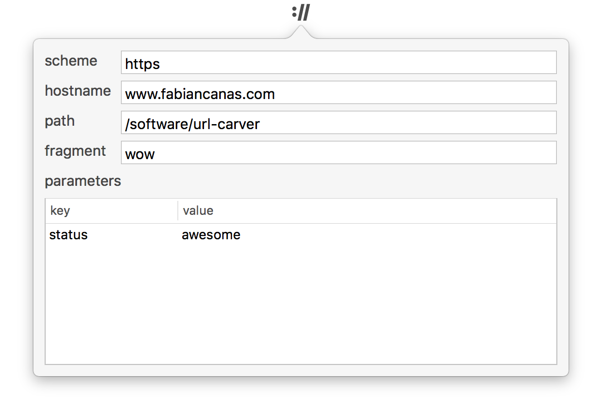

URL Carver lives in the menu bar . With a URL in your clipboard, click and see the URL's components based on [RFC 3986](https://www.ietf.org/rfc/rfc3986.txt).

https://www.fabiancanas.com/software/url-carver?status=awesome#wow turns into

## Download
* [URL Carver](URL-Carver.zip) version 1.0.2

## Change Log

| Version | |
|---------|-|
| 1.0.2 | Add right-click to quit |
| 1.0.1 | Fix collapsed query parameters table after inspecting a non-URL |
| 1.0   | Initial release                                                 |
